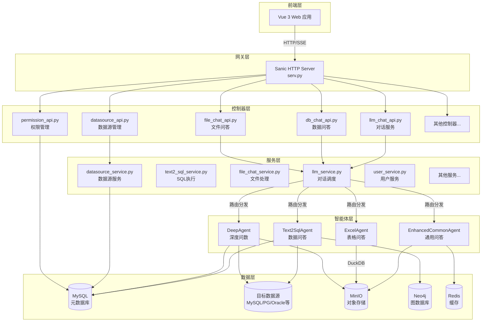
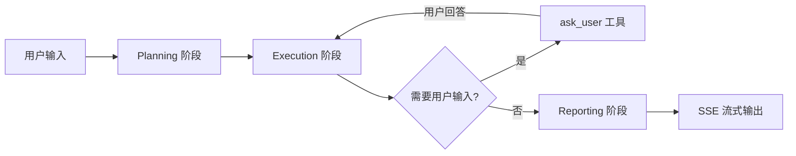
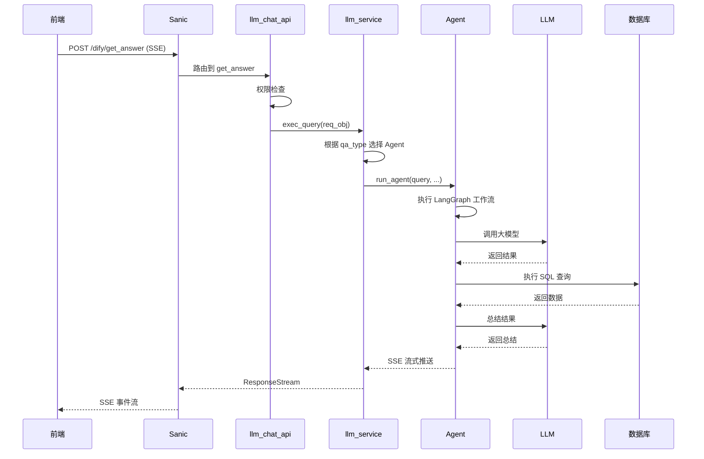
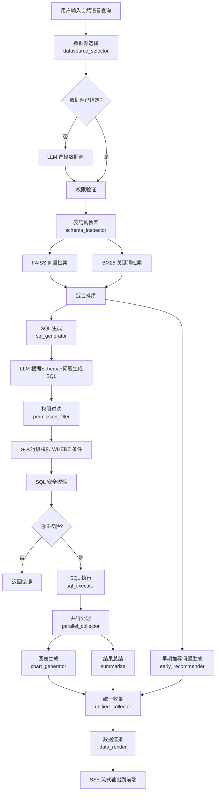
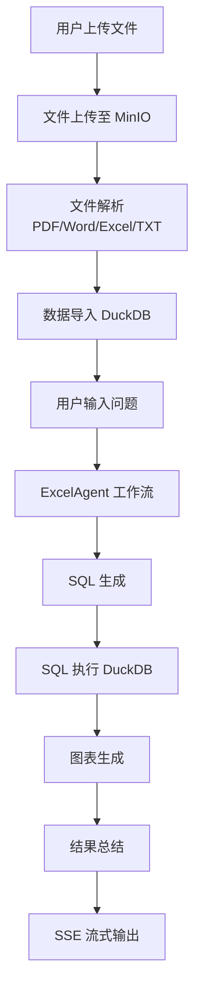
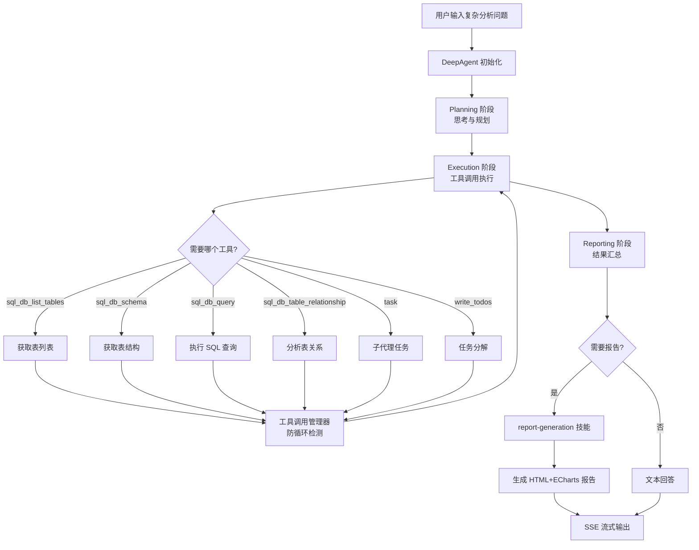

# Aix-DB 项目架构文档

> 基于大语言模型和 RAG 技术的智能数据分析系统（ChatBI），实现对话式数据提取与可视化。

---

## 目录

- [1. 项目概述](#1-项目概述)
- [2. 技术栈](#2-技术栈)
- [3. 整体架构](#3-整体架构)
- [4. 目录结构](#4-目录结构)
- [5. 核心模块详解](#5-核心模块详解)
  - [5.1 服务入口层 (serv.py)](#51-服务入口层-servpy)
  - [5.2 控制器层 (controllers/)](#52-控制器层-controllers)
  - [5.3 服务层 (services/)](#53-服务层-services)
  - [5.4 智能体层 (agent/)](#54-智能体层-agent)
  - [5.5 数据模型层 (model/)](#55-数据模型层-model)
  - [5.6 公共工具层 (common/)](#56-公共工具层-common)
  - [5.7 前端模块 (web/)](#57-前端模块-web)
  - [5.8 配置与部署](#58-配置与部署)
- [6. 核心处理流程](#6-核心处理流程)
- [7. 功能模块实现方式](#7-功能模块实现方式)
- [8. 外部依赖](#8-外部依赖)

---

## 1. 项目概述

Aix-DB 基于 **LangChain / LangGraph / DeepAgents** 框架，结合 **MCP Skills** 多智能体协作架构，实现自然语言到数据洞察的端到端转换。

**核心能力：**

| 能力 | 说明 |
|------|------|
| 通用问答 | 基于 LLM 的通用对话，支持 Skill 模式和 MCP 工具调用 |
| 数据问答 (Text2SQL) | 自然语言转 SQL，自动查询数据库并返回结果 |
| 表格问答 | 上传 Excel/CSV 文件后进行智能问答分析 |
| 深度问数 | 基于 DeepAgents 的多阶段深度数据分析与报告生成 |
| 数据可视化 | 自动生成 AntV/ECharts 图表 |
| MCP 多智能体 | 支持 MCP 协议的工具集成 |
| Skill 模式 | 可插拔的技能模块，支持前端设计、报告生成、Schema 探索等 |

---

## 2. 技术栈

### 后端

| 技术 | 用途 |
|------|------|
| Python 3.11 | 编程语言 |
| Sanic 25.x | 异步 Web 框架 |
| SQLAlchemy 2.x | ORM 数据库操作 |
| LangChain 1.x | LLM 应用框架 |
| LangGraph 1.x | 有状态多步骤 AI 工作流 |
| DeepAgents | 多智能体深度研究框架 |
| DuckDB | 嵌入式分析数据库（文件问答） |
| MinIO | 对象存储 |
| Redis | 缓存与会话 |
| Neo4j | 图数据库（表关系） |
| FAISS + BM25 | 向量检索 + 关键词检索 |

### 前端

| 技术 | 用途 |
|------|------|
| Vue 3 | 前端框架 |
| TypeScript | 类型安全 |
| Vite | 构建工具 |
| Naive UI | UI 组件库 |
| Pinia | 状态管理 |
| Vue Router 4 | 路由管理 |
| AntV | 数据可视化 |
| PDF.js | PDF 预览 |

### 基础设施

| 技术 | 用途 |
|------|------|
| Docker / Docker Compose | 容器化部署 |
| MySQL | 系统元数据库 |
| PostgreSQL | 可选数据源 |
| Langfuse | LLM 全链路监控（可选） |

---

## 3. 整体架构



---

## 4. 目录结构

```
Aix-db/
├── serv.py                    # 服务入口，Sanic 应用启动
├── pyproject.toml             # 项目依赖配置 (uv)
├── Makefile                   # Docker 镜像构建
├── requirements.txt           # pip 依赖
├── .env.dev / .env.pro        # 环境变量配置
│
├── controllers/               # 控制器层 (API 路由)
│   ├── llm_chat_api.py        # 对话服务 API
│   ├── db_chat_api.py         # 数据问答 API
│   ├── file_chat_api.py       # 文件问答 API
│   ├── datasource_api.py      # 数据源管理 API
│   ├── permission_api.py      # 权限管理 API
│   ├── skill_api.py           # 技能管理 API
│   ├── terminology_api.py     # 术语库管理 API
│   ├── knowledge_base_api.py  # 知识库管理 API
│   ├── data_training_api.py   # 数据训练 API
│   ├── aimodel_api.py         # AI 模型配置 API
│   ├── embedding_migration_api.py # 嵌入模型迁移 API
│   └── user_rest_api.py       # 用户管理 API
│
├── services/                  # 服务层 (业务逻辑)
│   ├── llm_service.py         # 对话调度核心服务
│   ├── text2_sql_service.py   # SQL 执行与查询服务
│   ├── file_chat_service.py   # 文件处理服务
│   ├── datasource_service.py  # 数据源管理服务
│   ├── permission_service.py  # 权限管理服务
│   ├── skill_service.py       # 技能管理服务
│   ├── terminology_service.py # 术语库服务
│   ├── knowledge_base_service.py # 知识库服务
│   ├── embedding_service.py   # 嵌入向量服务
│   ├── embedding_migration_service.py # 嵌入迁移服务
│   ├── data_training_service.py # 数据训练服务
│   ├── aimodel_service.py     # AI 模型配置服务
│   ├── user_service.py        # 用户管理服务
│   └── db_qadata_process.py   # 问答数据处理
│
├── agent/                     # 智能体层 (AI 核心)
│   ├── common/                # 通用智能体
│   │   ├── enhanced_common_agent.py  # 增强通用问答智能体
│   │   ├── tools/
│   │   │   └── ask_user_tool.py      # 向用户提问工具
│   │   └── agent_workspace/          # Agent 工作目录
│   │
│   ├── text2sql/              # Text2SQL 智能体
│   │   ├── text2_sql_agent.py       # Text2SQL 主控
│   │   ├── analysis/
│   │   │   ├── graph.py             # LangGraph 工作流定义
│   │   │   ├── llm_summarizer.py    # LLM 结果总结
│   │   │   ├── data_render_antv.py  # AntV 图表渲染
│   │   │   ├── data_render_apache.py # Apache ECharts 渲染
│   │   │   ├── parallel_collector.py # 并行收集器
│   │   │   ├── unified_collector.py  # 统一收集器
│   │   │   └── early_recommender_helper.py # 提前推荐问题
│   │   ├── sql/
│   │   │   └── generator.py         # SQL 生成器
│   │   ├── database/
│   │   │   ├── db_service.py        # 数据库服务（Schema 检索+SQL 执行）
│   │   │   └── neo4j_search.py      # Neo4j 图搜索
│   │   ├── datasource/
│   │   │   └── selector.py          # 数据源选择器
│   │   ├── permission/
│   │   │   ├── permission_retriever.py # 权限检索
│   │   │   ├── filter_injector.py     # 权限过滤器注入
│   │   │   └── row_permission.py      # 行级权限转换
│   │   ├── chart/
│   │   │   └── generator.py          # 图表生成器
│   │   ├── question/
│   │   │   └── recommender.py        # 问题推荐器
│   │   ├── rag/
│   │   │   ├── terminology_retriever.py # 术语检索
│   │   │   └── training_retriever.py    # 训练数据检索
│   │   ├── dynamic/
│   │   │   └── generator.py          # 动态 SQL 生成
│   │   ├── state/
│   │   │   └── agent_state.py        # Agent 状态定义
│   │   └── template/
│   │       ├── prompt_builder.py     # Prompt 构建器
│   │       ├── schema_formatter.py   # Schema 格式化
│   │       ├── template_loader.py    # 模板加载器
│   │       └── yaml/                 # Prompt 模板与 SQL 示例
│   │
│   ├── excel/                 # 表格问答智能体
│   │   ├── excel_agent.py           # 表格问答主控
│   │   ├── excel_graph.py           # LangGraph 工作流
│   │   ├── excel_agent_state.py     # 状态定义
│   │   ├── excel_duckdb_manager.py  # DuckDB 管理
│   │   ├── excel_excute_sql.py      # SQL 执行
│   │   ├── excel_sql_node.py        # SQL 生成节点
│   │   ├── excel_chart_generator.py # 图表生成
│   │   ├── excel_summarizer.py      # 结果总结
│   │   ├── excel_data_render_antv.py # AntV 渲染
│   │   ├── excel_data_render_apache.py # ECharts 渲染
│   │   ├── excel_mapping_node.py    # 字段映射
│   │   ├── excel_question_recommender.py # 问题推荐
│   │   ├── early_recommender_helper.py   # 提前推荐
│   │   ├── parallel_collector.py    # 并行收集
│   │   ├── unified_collector.py     # 统一收集
│   │   └── template/                # 模板
│   │
│   ├── deepagent/             # 深度问数智能体
│   │   ├── deep_research_agent.py   # 深度研究主控
│   │   ├── tools/
│   │   │   ├── native_sql_tools.py  # 原生 SQL 工具集
│   │   │   └── tool_call_manager.py # 工具调用管理器
│   │   ├── skills/
│   │   │   ├── frontend-design/     # 前端设计技能
│   │   │   ├── langfuse/            # Langfuse 技能
│   │   │   ├── query-writing/       # 查询编写技能
│   │   │   ├── report-generation/   # 报告生成技能
│   │   │   └── schema-exploration/  # Schema 探索技能
│   │   └── AGENTS.md                # Agent 指令
│   │
│   ├── mcp/                   # MCP 工具
│   │   ├── query_qa_history.py        # 问答历史查询
│   │   └── query_qa_history_mcp.py    # MCP 版本
│   │
│   ├── middleware/            # LangChain 中间件
│   │   └── customer_middleware.py # 自定义中间件
│   │
│   └── context/               # 对话上下文
│       └── conversation_history_manager.py # 历史管理
│
├── model/                     # 数据模型层
│   ├── db_models.py           # 系统元数据 ORM 模型
│   ├── datasource_models.py   # 数据源相关 ORM 模型
│   ├── db_connection_pool.py  # 数据库连接池
│   ├── schemas.py             # Pydantic 请求/响应 Schema
│   └── serializers.py         # 序列化器
│
├── common/                    # 公共工具层
│   ├── llm_util.py            # LLM 统一调用工具
│   ├── langfuse_util.py       # Langfuse 追踪工具
│   ├── datasource_util.py     # 数据源连接工具
│   ├── mysql_util.py          # MySQL 工具
│   ├── duckdb_util.py         # DuckDB 工具
│   ├── minio_util.py          # MinIO 对象存储工具
│   ├── redis_tool.py          # Redis 工具
│   ├── sql_security.py        # SQL 安全校验
│   ├── file_parse.py          # 文件解析工具
│   ├── pdf_util.py            # PDF 处理工具
│   ├── word_util.py           # Word 处理工具
│   ├── date_util.py           # 日期工具
│   ├── param_parser.py        # 参数解析器
│   ├── res_decorator.py       # 响应装饰器
│   ├── token_decorator.py     # Token 验证装饰器
│   ├── route_utility.py       # 路由自动发现
│   ├── permission_util.py     # 权限工具
│   ├── exception.py           # 自定义异常
│   ├── local_embedding.py     # 本地嵌入模型
│   ├── mcp_client.py          # MCP 客户端
│   ├── initialize_datasource_tables.py # 初始化数据源表
│   ├── initialize_mysql.py    # MySQL 初始化
│   ├── initialize_neo4j.py    # Neo4j 初始化
│   ├── initialize_postgres.py # PostgreSQL 初始化
│   └── neo4j/                 # Neo4j 相关工具
│       ├── mapper_to_neo4j.py       # MyBatis Mapper 导入
│       ├── quick_mapper_to_neo4j.py # 快速导入
│       ├── mybatis_mapper_parser.py # Mapper 解析器
│       ├── mapper_relationships.json # 关系映射配置
│       ├── generated_relationships.py # 生成的关系
│       └── sql_log_parser/          # SQL 日志解析
│
├── config/                    # 配置层
│   ├── load_env.py            # 环境变量加载
│   └── logging.conf           # 日志配置
│
├── constants/                 # 常量定义
│   ├── code_enum.py           # 状态码枚举
│   └── dify_rest_api.py       # Dify REST API 常量
│
├── docker/                    # Docker 部署
│   ├── Dockerfile             # 应用镜像
│   ├── Dockerfile.base        # 基础镜像
│   └── volume/                # 数据卷
│
├── docs/                      # 文档
│   ├── docs/                  # MkDocs 源文档
│   ├── site/                  # 生成的静态站点
│   ├── mkdocs.yml             # MkDocs 配置
│   ├── swagger.html           # Swagger API 文档
│   └── redoc.html             # ReDoc API 文档
│
├── models/                    # 本地模型文件
│   └── models--shibing624--text2vec-base-chinese/  # 离线 Embedding 模型
│
└── web/                       # 前端项目
    ├── src/
    │   ├── main.ts            # 入口文件
    │   ├── views/             # 页面组件
    │   ├── components/        # 通用组件
    │   ├── router/            # 路由配置
    │   ├── store/             # 状态管理 (Pinia)
    │   ├── hooks/             # 组合式函数
    │   ├── utils/             # 工具函数
    │   ├── styles/            # 样式文件
    │   ├── config/            # 配置文件
    │   └── types/             # TypeScript 类型定义
    ├── public/                # 静态资源
    │   └── pdfjs-4.10.38-dist/ # PDF.js 库
    ├── package.json           # 前端依赖
    └── vite.config.ts         # Vite 配置
```

---

## 5. 核心模块详解

### 5.1 服务入口层 (serv.py)

**文件路径:** `serv.py`

整个系统的入口文件，负责：

- 创建 Sanic 应用实例
- 配置 Worker 启动超时
- 加载环境变量
- 配置日志系统
- 初始化 MinIO Bucket
- 自动发现并注册所有控制器蓝图

**核心实现：**

```python
# 创建 Sanic 应用
app = Sanic("Aix-DB", configure_logging=False)

# 主进程启动时初始化 MinIO
@app.main_process_start
async def init_minio(app, loop):
    minio_utils = MinioUtils()
    minio_utils.ensure_bucket(default_bucket)

# 自动发现控制器路由
autodiscover(app, controllers, recursive=True)
```

### 5.2 控制器层 (controllers/)

控制器层负责接收 HTTP 请求，参数解析，调用服务层，返回响应。使用 Sanic Blueprint 组织路由。

| 文件 | 路由前缀 | 功能 |
|------|---------|------|
| [llm_chat_api.py](file:///root/Aix-db/controllers/llm_chat_api.py) | `/dify` | 对话服务入口，支持流式 SSE 响应 |
| [db_chat_api.py](file:///root/Aix-db/controllers/db_chat_api.py) | `/llm` | 数据问答 SQL 处理 |
| [file_chat_api.py](file:///root/Aix-db/controllers/file_chat_api.py) | `/api` | 文件上传与问答 |
| [datasource_api.py](file:///root/Aix-db/controllers/datasource_api.py) | `/api` | 数据源 CRUD 管理 |
| [permission_api.py](file:///root/Aix-db/controllers/permission_api.py) | `/api` | 权限配置管理 |
| [skill_api.py](file:///root/Aix-db/controllers/skill_api.py) | `/api` | 技能管理 |
| [terminology_api.py](file:///root/Aix-db/controllers/terminology_api.py) | `/api` | 术语库管理 |
| [knowledge_base_api.py](file:///root/Aix-db/controllers/knowledge_base_api.py) | `/api` | 知识库管理 |
| [data_training_api.py](file:///root/Aix-db/controllers/data_training_api.py) | `/api` | 数据训练管理 |
| [aimodel_api.py](file:///root/Aix-db/controllers/aimodel_api.py) | `/api` | AI 模型配置 |
| [embedding_migration_api.py](file:///root/Aix-db/controllers/embedding_migration_api.py) | `/api` | 嵌入模型迁移 |
| [user_rest_api.py](file:///root/Aix-db/controllers/user_rest_api.py) | `/api` | 用户管理 |

**关键控制器详解：**

#### llm_chat_api.py - 对话服务入口

这是最核心的控制器，提供两个主要端点：

- `POST /dify/get_answer` - 流式对话接口（SSE），根据 `qa_type` 路由到不同的 Agent：
  - `COMMON_QA` -> EnhancedCommonAgent（通用问答）
  - `DATABASE_QA` -> Text2SqlAgent（数据问答）
  - `FILEDATA_QA` -> ExcelAgent（表格问答）
  - `REPORT_QA` -> DeepAgent（深度问数）
- 支持权限检查：在 DATABASE_QA 模式下，提前验证用户是否有数据源访问权限

### 5.3 服务层 (services/)

服务层封装业务逻辑，是控制器层与智能体层之间的桥梁。

| 文件 | 功能 |
|------|------|
| [llm_service.py](file:///root/Aix-db/services/llm_service.py) | **核心调度服务**：根据 qa_type 路由到不同 Agent，处理 SSE 流式输出 |
| [text2_sql_service.py](file:///root/Aix-db/services/text2_sql_service.py) | SQL 执行服务：执行 SQL 查询、获取表 Schema、SQL 安全校验 |
| [file_chat_service.py](file:///root/Aix-db/services/file_chat_service.py) | 文件处理服务：文件上传解析、DuckDB 数据管理 |
| [datasource_service.py](file:///root/Aix-db/services/datasource_service.py) | 数据源管理：数据源 CRUD、连接测试、表结构同步 |
| [permission_service.py](file:///root/Aix-db/services/permission_service.py) | 权限管理：用户权限、行级权限、字段权限 |
| [skill_service.py](file:///root/Aix-db/services/skill_service.py) | 技能管理：技能 CRUD、技能文件管理 |
| [terminology_service.py](file:///root/Aix-db/services/terminology_service.py) | 术语库：术语 CRUD、向量化存储 |
| [knowledge_base_service.py](file:///root/Aix-db/services/knowledge_base_service.py) | 知识库：文档上传、向量化、检索 |
| [embedding_service.py](file:///root/Aix-db/services/embedding_service.py) | 嵌入服务：文本向量化 |
| [user_service.py](file:///root/Aix-db/services/user_service.py) | 用户服务：JWT 认证、用户管理、问答记录 |
| [db_qadata_process.py](file:///root/Aix-db/services/db_qadata_process.py) | 问答数据处理：查询报告、数据处理 |

**llm_service.py 核心调度逻辑：**

```python
# 根据 qa_type 分发到不同的 Agent
if qa_type == IntentEnum.COMMON_QA:
    await common_agent.run_agent(query, res, chat_id, uuid_str, token, file_list)
elif qa_type == IntentEnum.DATABASE_QA:
    await sql_agent.run_agent(query, res, chat_id, uuid_str, token, datasource_id)
elif qa_type == IntentEnum.FILEDATA_QA:
    await excel_agent.run_excel_agent(cleaned_query, res, chat_id, uuid_str, token, file_list)
elif qa_type == IntentEnum.REPORT_QA:
    await deep_agent.run_agent(cleaned_query, res, chat_id, uuid_str, token, file_list, datasource_id)
```

### 5.4 智能体层 (agent/)

智能体层是系统的 AI 核心，包含四种智能体，各自处理不同类型的问答场景。

#### 5.4.1 EnhancedCommonAgent - 通用问答智能体

**文件路径:** [agent/common/enhanced_common_agent.py](file:///root/Aix-db/agent/common/enhanced_common_agent.py)

基于 DeepAgents 框架的增强通用问答智能体。

**核心特性：**
- 基于 `create_deep_agent` 构建，支持 Skill + MCP + 多轮对话
- 三个阶段执行：Planning（规划） -> Execution（执行） -> Reporting（报告）
- 思考过程可视化（使用 `<details>` 折叠标签）
- 支持 `ask_user` 工具，可在执行中向用户提问
- 支持 LangGraph 的 `interrupt()` 机制实现暂停/恢复
- 会话级工具调用管理，防止死循环

**输入输出：**
- 输入：用户查询文本、文件列表、选中技能列表
- 输出：SSE 流式推送，包含思考过程（t01）和回答内容（t02）

**工作流程：**



#### 5.4.2 Text2SqlAgent - 数据问答智能体

**文件路径:** [agent/text2sql/text2_sql_agent.py](file:///root/Aix-db/agent/text2sql/text2_sql_agent.py)

基于 LangGraph 构建的有状态 Text-to-SQL 工作流。

**核心特性：**
- 多阶段流水线：数据源选择 -> Schema 检索 -> SQL 生成 -> 权限过滤 -> SQL 执行 -> 图表生成 -> 结果总结
- FAISS + BM25 混合检索表结构（向量检索 + 关键词检索）
- 支持 jieba 中文分词提升检索精度
- 行级权限自动注入 SQL WHERE 条件
- 支持动态数据源（子查询替换表名）
- 支持 Langfuse 全链路追踪

**LangGraph 工作流节点：**

```
datasource_selector  →  schema_inspector  →  early_recommender
                                                   ↓
                                              sql_generator
                                                   ↓
                                           permission_filter
                                                   ↓
                                              sql_executor
                                                   ↓
                                          parallel_collector
                                          (chart + summarize)
                                                   ↓
                                           unified_collector
                                                   ↓
                                             data_render
```

**各节点功能：**

| 节点 | 文件 | 功能 |
|------|------|------|
| datasource_selector | [selector.py](file:///root/Aix-db/agent/text2sql/datasource/selector.py) | 使用 LLM 从多个数据源中选择最合适的一个 |
| schema_inspector | [db_service.py](file:///root/Aix-db/agent/text2sql/database/db_service.py) | 检索表结构信息（FAISS+BM25 混合检索） |
| early_recommender | [early_recommender_helper.py](file:///root/Aix-db/agent/text2sql/analysis/early_recommender_helper.py) | 提前异步生成推荐问题 |
| sql_generator | [generator.py](file:///root/Aix-db/agent/text2sql/sql/generator.py) | LLM 生成 SQL 语句 |
| permission_filter | [filter_injector.py](file:///root/Aix-db/agent/text2sql/permission/filter_injector.py) | 注入行级权限过滤条件 |
| sql_executor | [db_service.py](file:///root/Aix-db/agent/text2sql/database/db_service.py) | 执行 SQL 查询，返回结果 |
| chart_generator | [generator.py](file:///root/Aix-db/agent/text2sql/chart/generator.py) | 根据数据自动生成图表配置 |
| summarize | [llm_summarizer.py](file:///root/Aix-db/agent/text2sql/analysis/llm_summarizer.py) | LLM 总结查询结果 |
| data_render | [data_render_antv.py](file:///root/Aix-db/agent/text2sql/analysis/data_render_antv.py) | 渲染 AntV/ECharts 图表数据 |

**SQL 安全校验：**

所有 SQL 在执行前都会经过 [sql_security.py](file:///root/Aix-db/common/sql_security.py) 的安全校验：

- 使用 `sqlglot` 解析 SQL AST
- 禁止 INSERT、UPDATE、DELETE、DROP、ALTER、TRUNCATE、CREATE 等写入操作
- 仅允许 SELECT 只读查询
- 支持多种数据库方言（MySQL、PostgreSQL、Oracle、ClickHouse、SQL Server 等）

#### 5.4.3 ExcelAgent - 表格问答智能体

**文件路径:** [agent/excel/excel_agent.py](file:///root/Aix-db/agent/excel/excel_agent.py)

处理上传的 Excel/CSV 文件并进行智能问答。

**核心特性：**
- 使用 DuckDB 作为嵌入式分析引擎
- 自动解析 Excel/CSV 文件并导入 DuckDB
- 生成 SQL 查询 DuckDB 中的数据
- 支持图表生成和结果总结
- 流程与 Text2SqlAgent 类似，但使用 DuckDB 替代外部数据库

**工作流程：**


#### 5.4.4 DeepAgent - 深度问数智能体

**文件路径:** [agent/deepagent/deep_research_agent.py](file:///root/Aix-db/agent/deepagent/deep_research_agent.py)

基于 DeepAgents 的多阶段深度研究智能体，用于复杂数据分析和报告生成。

**核心特性：**
- 多阶段执行：思考规划 -> 执行 -> 回答/报告
- 原生 SQL 工具集：`sql_db_list_tables`、`sql_db_schema`、`sql_db_query`、`sql_db_query_checker`、`sql_db_table_relationship`
- 5 大内置技能（Skill）：
  - `schema-exploration` - 数据库 Schema 探索
  - `query-writing` - SQL 查询编写
  - `report-generation` - 报告生成（HTML + ECharts）
  - `frontend-design` - 前端设计
  - `langfuse` - 可观测性分析
- 会话级工具调用管理器，防止死循环和重复调用
- 支持 LangGraph 的 checkpoint 机制（InMemorySaver）

**工具调用管理器 ([tool_call_manager.py](file:///root/Aix-db/agent/deepagent/tools/tool_call_manager.py))：**

- 每个会话独立管理工具调用状态
- 检测循环模式：连续调用同一工具超过阈值则终止
- 检测重复 SQL 查询
- 统计工具调用次数和成功率

#### 5.4.5 MCP 工具

**文件路径:** [agent/mcp/](file:///root/Aix-db/agent/mcp/)

提供 MCP 协议兼容的工具：

- `query_qa_history` - 查询用户问答历史记录
- `query_qa_history_mcp` - MCP 版本

#### 5.4.6 中间件

**文件路径:** [agent/middleware/customer_middleware.py](file:///root/Aix-db/agent/middleware/customer_middleware.py)

LangChain 自定义中间件，支持：

- `@before_model` - 模型调用前日志记录
- `@after_model` - 模型响应后验证（可跳转到指定节点）
- `@wrap_model_call` - 模型调用重试逻辑（最多 3 次）
- `@wrap_tool_call` - 工具调用包装
- `@dynamic_prompt` - 动态 Prompt 注入

### 5.5 数据模型层 (model/)

**文件路径:** [model/](file:///root/Aix-db/model/)

| 文件 | 功能 |
|------|------|
| [db_models.py](file:///root/Aix-db/model/db_models.py) | 系统元数据 ORM 模型（AI 模型、权限、规则、问答记录等） |
| [datasource_models.py](file:///root/Aix-db/model/datasource_models.py) | 数据源相关 ORM 模型（数据源、表、字段、权限等） |
| [db_connection_pool.py](file:///root/Aix-db/model/db_connection_pool.py) | 数据库连接池管理 |
| [schemas.py](file:///root/Aix-db/model/schemas.py) | Pydantic 请求/响应 Schema 定义 |
| [serializers.py](file:///root/Aix-db/model/serializers.py) | 序列化器 |

### 5.6 公共工具层 (common/)

**文件路径:** [common/](file:///root/Aix-db/common/)

| 文件 | 功能 |
|------|------|
| [llm_util.py](file:///root/Aix-db/common/llm_util.py) | LLM 统一调用：从数据库获取默认模型配置，创建 ChatOpenAI 实例，支持 OpenAI/DeepSeek/Qwen/Ollama/vLLM 等多种供应商 |
| [langfuse_util.py](file:///root/Aix-db/common/langfuse_util.py) | Langfuse 追踪：提供 `langfuse_trace_context` 上下文管理器，支持全链路监控 |
| [datasource_util.py](file:///root/Aix-db/common/datasource_util.py) | 数据源连接：统一管理多种数据库连接（MySQL、PostgreSQL、Oracle、SQL Server、ClickHouse、Doris 等） |
| [sql_security.py](file:///root/Aix-db/common/sql_security.py) | SQL 安全：使用 sqlglot 解析 SQL AST，禁止写入操作，仅允许只读查询 |
| [minio_util.py](file:///root/Aix-db/common/minio_util.py) | MinIO 对象存储：文件上传/下载、Bucket 管理 |
| [redis_tool.py](file:///root/Aix-db/common/redis_tool.py) | Redis 缓存工具 |
| [file_parse.py](file:///root/Aix-db/common/file_parse.py) | 文件解析：支持 PDF、Word、Excel、TXT 等格式 |
| [local_embedding.py](file:///root/Aix-db/common/local_embedding.py) | 本地嵌入模型：使用 text2vec-base-chinese 进行离线向量化 |
| [mcp_client.py](file:///root/Aix-db/common/mcp_client.py) | MCP 客户端 |
| [route_utility.py](file:///root/Aix-db/common/route_utility.py) | 路由自动发现：递归扫描控制器目录，自动注册 Blueprint |
| [token_decorator.py](file:///root/Aix-db/common/token_decorator.py) | Token 验证装饰器 |
| [res_decorator.py](file:///root/Aix-db/common/res_decorator.py) | 响应装饰器：统一 JSON 响应格式 |
| [param_parser.py](file:///root/Aix-db/common/param_parser.py) | 参数解析器：自动解析请求参数 |
| [permission_util.py](file:///root/Aix-db/common/permission_util.py) | 权限工具 |
| [exception.py](file:///root/Aix-db/common/exception.py) | 自定义异常类 |
| [neo4j/](file:///root/Aix-db/common/neo4j/) | Neo4j 图数据库工具：MyBatis Mapper 解析、SQL 日志解析、表关系图谱构建 |

### 5.7 前端模块 (web/)

**文件路径:** [web/src/](file:///root/Aix-db/web/src/)

基于 Vue 3 + TypeScript + Naive UI 构建的单页应用。

#### 页面结构

| 页面 | 文件路径 | 功能 |
|------|---------|------|
| 对话主页 | [views/chat/index.vue](file:///root/Aix-db/web/src/views/chat/index.vue) | 核心对话界面，支持多轮对话、流式输出 |
| 默认页 | [views/chat/default-page.vue](file:///root/Aix-db/web/src/views/chat/default-page.vue) | 对话入口默认状态 |
| 推荐页 | [views/chat/suggested-page.vue](file:///root/Aix-db/web/src/views/chat/suggested-page.vue) | 推荐问题展示 |
| 数据源管理 | [views/datasource/datasource-manager.vue](file:///root/Aix-db/web/src/views/datasource/datasource-manager.vue) | 数据源配置 |
| 表关系 | [views/datasource/table-relationship.vue](file:///root/Aix-db/web/src/views/datasource/table-relationship.vue) | 表关系可视化 |
| Neo4j 关系 | [views/datasource/neo4j-relationship.vue](file:///root/Aix-db/web/src/views/datasource/neo4j-relationship.vue) | Neo4j 图关系展示 |
| 文件管理 | [views/file/file-upload-manager.vue](file:///root/Aix-db/web/src/views/file/file-upload-manager.vue) | 文件上传管理 |
| PDF 预览 | [views/file/pdf-viewer.vue](file:///root/Aix-db/web/src/views/file/pdf-viewer.vue) | 基于 PDF.js 的 PDF 预览 |
| 知识库 | [views/knowledge/knowledge-manager.vue](file:///root/Aix-db/web/src/views/knowledge/knowledge-manager.vue) | 知识库管理 |
| 需求管理 | [views/knowledge/demand-manager.vue](file:///root/Aix-db/web/src/views/knowledge/demand-manager.vue) | 需求管理 |
| 技能中心 | [views/skill-center.vue](file:///root/Aix-db/web/src/views/skill-center.vue) | 技能管理 |
| 系统设置 | [views/system/system-settings.vue](file:///root/Aix-db/web/src/views/system/system-settings.vue) | 系统设置主页 |
| LLM 配置 | [views/system/config/llm-config.vue](file:///root/Aix-db/web/src/views/system/config/llm-config.vue) | 大模型配置 |
| 术语配置 | [views/system/config/terminology-config.vue](file:///root/Aix-db/web/src/views/system/config/terminology-config.vue) | 术语库配置 |
| SQL 示例库 | [views/system/config/sql-example-library.vue](file:///root/Aix-db/web/src/views/system/config/sql-example-library.vue) | SQL 示例管理 |
| 嵌入迁移 | [views/system/config/embedding-migration.vue](file:///root/Aix-db/web/src/views/system/config/embedding-migration.vue) | 嵌入模型迁移 |
| 权限管理 | [views/system/permission/](file:///root/Aix-db/web/src/views/system/permission/) | 权限树、行权限、字段过滤 |
| 用户管理 | [views/user/user-manager.vue](file:///root/Aix-db/web/src/views/user/user-manager.vue) | 用户管理 |
| 登录 | [views/auth/login.vue](file:///root/Aix-db/web/src/views/auth/login.vue) | 登录页面 |

#### 核心组件

| 组件 | 文件路径 | 功能 |
|------|---------|------|
| MarkdownPreview | [components/MarkdownPreview/](file:///root/Aix-db/web/src/components/MarkdownPreview/) | Markdown 渲染，支持 AntV 图表、HTML 报告、代码高亮 |
| Layout | [components/Layout/](file:///root/Aix-db/web/src/components/Layout/) | 布局组件（SlotFrame、SlotCenterPanel、SidebarPage） |
| Navigation | [components/Navigation/](file:///root/Aix-db/web/src/components/Navigation/) | 导航栏、侧边栏、底部栏 |
| SkillCommandPopup | [components/SkillCommandPopup.vue](file:///root/Aix-db/web/src/components/SkillCommandPopup.vue) | 技能命令弹窗 |
| AgentInputRequest | [components/AgentInputRequest.vue](file:///root/Aix-db/web/src/components/AgentInputRequest.vue) | Agent 输入框（支持文件上传、技能选择） |
| PdfViewer | [views/file/pdf-viewer.vue](file:///root/Aix-db/web/src/views/file/pdf-viewer.vue) | PDF 预览组件 |

#### 状态管理

- **Pinia** 状态管理，存储在 [store/](file:///root/Aix-db/web/src/store/)
- 主要 Store：
  - `useAppStore` - 应用全局状态
  - `userStore` - 用户状态
  - `initChatHistory` - 对话历史初始化

#### 路由设计

- 根路径 `/` -> 重定向到对话主页
- `/login` -> 登录页
- 子路由包括：对话、数据源、文件、知识库、技能、系统设置、用户管理

### 5.8 配置与部署

#### 环境变量 (.env)

系统通过 `.env.dev`、`.env.pro` 等文件配置环境变量，包括：

- 数据库连接信息
- MinIO 配置
- Redis 配置
- LLM 超时配置
- Langfuse 追踪配置
- Sanic Worker 配置

#### Docker 部署

**文件路径:** [docker/](file:///root/Aix-db/docker/)

- [Dockerfile.base](file:///root/Aix-db/docker/Dockerfile.base) - 基础镜像（包含 Python 和 Node.js 依赖）
- [Dockerfile](file:///root/Aix-db/docker/Dockerfile) - 应用镜像
- 支持多架构构建（linux/amd64, linux/arm64）
- 通过 Makefile 管理构建和推送

#### 依赖管理

- 使用 `uv` 进行 Python 依赖管理（[pyproject.toml](file:///root/Aix-db/pyproject.toml)）
- 使用 `pnpm` 进行前端依赖管理（[web/package.json](file:///root/Aix-db/web/package.json)）

---

## 6. 核心处理流程

### 6.1 整体请求处理流程



### 6.2 Text2SQL 数据问答流程



### 6.3 文件问答流程



### 6.4 深度问数流程



---

## 7. 功能模块实现方式

### 7.1 对话式数据问答 (Text2SQL)

**实现方式：LangGraph 有状态工作流 + LLM SQL 生成**

1. **数据源选择**：当用户未指定数据源时，LLM 根据用户查询语义从多个数据源中选择最合适的一个
2. **表结构检索**：使用 FAISS + BM25 混合检索，从数据库中检索与用户问题最相关的表结构
   - FAISS 向量检索：基于表名、字段名、注释的语义向量相似度
   - BM25 关键词检索：基于 jieba 分词的关键词匹配
   - 混合排序：综合两种检索结果
3. **SQL 生成**：将表结构、用户问题、数据库类型作为 Prompt，由 LLM 生成 SQL
4. **权限过滤**：在执行前自动注入行级权限 WHERE 条件
5. **SQL 安全校验**：使用 sqlglot 解析 AST，禁止非 SELECT 语句
6. **结果执行与总结**：执行 SQL，LLM 总结结果，生成图表

### 7.2 表格问答 (Excel/CSV)

**实现方式：DuckDB 嵌入式分析 + LangGraph 工作流**

1. 文件上传到 MinIO，后端解析文件内容
2. 将数据导入 DuckDB（内存数据库）
3. 使用与 Text2SQL 类似的工作流生成 SQL 查询 DuckDB
4. 执行查询，生成图表，总结结果

### 7.3 深度问数 (Deep Research)

**实现方式：DeepAgents 多智能体 + 原生 SQL 工具**

1. 使用 `create_deep_agent` 创建深度研究智能体
2. 提供 5 个原生 SQL 工具：表列表、表结构、查询执行、查询校验、表关系
3. 工具调用管理器防止死循环：
   - 检测连续调用同一工具
   - 检测重复 SQL 查询
   - 限制重试次数
4. 内置 5 大技能文档，指导 Agent 行为
5. 支持子代理任务分发

### 7.4 通用问答 (Common QA)

**实现方式：DeepAgents + Skill + MCP**

1. 基于 `create_deep_agent` 创建通用智能体
2. 支持 Skill 模式：加载 YAML 技能文件，按技能指令执行
3. 支持 MCP 工具：通过 MCP 协议集成外部工具
4. 支持 `ask_user` 工具，通过 LangGraph interrupt() 实现人机交互
5. 三阶段执行：Planning -> Execution -> Reporting

### 7.5 权限管理

**实现方式：行级权限 + 字段级权限**

1. **行级权限**：在 SQL 生成后、执行前，自动注入 WHERE 条件
   - 支持多种数据库方言的引号处理（MySQL 反引号、PostgreSQL 双引号、SQL Server 方括号）
   - 支持多种操作符：eq、not_eq、lt、gt、in、like、between、null 等
2. **字段级权限**：过滤用户无权查看的字段
3. **数据源权限**：控制用户可访问的数据源

### 7.6 表结构检索 (Schema Retrieval)

**实现方式：FAISS + BM25 混合检索**

1. 获取所有表的结构信息（表名、字段名、字段注释）
2. 使用在线 Embedding 模型或离线 text2vec-base-chinese 模型进行向量化
3. FAISS 索引存储向量，BM25 索引存储关键词
4. 用户查询时，同时进行向量检索和关键词检索
5. 混合排序返回最相关的 Top-N 表结构

### 7.7 SQL 安全校验

**实现方式：sqlglot AST 解析**

1. 使用 `sqlglot` 解析 SQL 为抽象语法树（AST）
2. 遍历 AST 检测禁止的表达式类型（INSERT、UPDATE、DELETE、DROP、ALTER、TRUNCATE、CREATE 等）
3. 支持多种数据库方言：MySQL、PostgreSQL、Oracle、ClickHouse、SQL Server、Doris、StarRocks、Redshift、DM 等
4. 校验失败则抛出异常，阻止 SQL 执行

### 7.8 图表生成

**实现方式：LLM 生成图表配置 + 前端渲染**

1. LLM 根据查询结果数据，自动判断合适的图表类型（柱状图、饼图、折线图等）
2. 生成 AntV 或 ECharts 图表配置 JSON
3. 前端 MarkdownPreview 组件解析配置，渲染图表

### 7.9 流式输出 (SSE)

**实现方式：Sanic ResponseStream + Server-Sent Events**

1. 后端使用 Sanic 的 `ResponseStream` 实现 SSE
2. 数据格式：`data: {type, content, ...}\n\n`
3. 支持多种数据类型：
   - `t01` - 思考过程（折叠在 `<details>` 中）
   - `t02` - 回答内容
   - `t03` - 进度信息
   - `t04` - 业务数据（图表配置、SQL 等）
   - `t05` - 错误信息
4. 前端使用 EventSource 或 fetch 读取 SSE 流

### 7.10 全链路监控 (Langfuse)

**实现方式：可选集成 Langfuse**

1. 通过环境变量 `LANGFUSE_TRACING_ENABLED=true` 启用
2. 使用 `langfuse_trace_context` 上下文管理器包裹 Agent 执行
3. 创建 `CallbackHandler` 自动追踪 LLM 调用
4. 记录每次调用的输入、输出、耗时、Token 消耗

### 7.11 Neo4j 图关系

**实现方式：Neo4j 图数据库存储表关系**

1. 支持从 MyBatis Mapper XML 解析表关系
2. 支持从 SQL 日志解析表关系
3. 自动构建表关系图谱
4. 前端可视化展示表关系

---

## 8. 外部依赖

| 服务 | 用途 | 是否必须 |
|------|------|---------|
| MySQL | 系统元数据存储 | 必须 |
| MinIO | 文件对象存储 | 必须 |
| Redis | 缓存与会话 | 必须 |
| Neo4j | 表关系图谱（可选） | 可选 |
| Langfuse | LLM 全链路监控 | 可选 |
| DuckDB | 文件问答分析引擎 | 自动集成 |
| LLM API | 大语言模型服务 | 必须（支持 OpenAI/DeepSeek/Qwen/Ollama/vLLM 等） |

### 支持的数据源类型

| 数据库 | 方言标识 |
|--------|---------|
| MySQL | mysql |
| PostgreSQL | postgresql |
| Oracle | oracle |
| SQL Server | sqlserver |
| ClickHouse | clickhouse |
| StarRocks | starrocks |
| Apache Doris | doris |
| 达梦 DM | dm |
| AWS Redshift | redshift |
| Elasticsearch | elasticsearch |
| 人大金仓 Kingbase | kingbase |

---

> 文档版本: 1.0 | 生成日期: 2026-06-30 | 项目版本: 1.2.4