# Aix-DB LangGraph 工作流节点交互时序图

> 针对 Text2SQL 智能体（`Text2SqlAgent`）的 LangGraph 工作流，详细展示各节点之间的交互时序、状态流转与数据传递。

---

## 1. 工作流拓扑结构

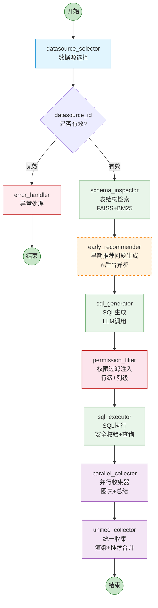

**图例说明：**
- 🔵 蓝色：数据源选择阶段
- 🟢 绿色：Schema 检索与 SQL 生成阶段
- 🟠 橙色虚线：后台异步执行（不阻塞主流程）
- 🔴 红色：权限过滤与安全校验阶段
- 🟣 紫色：并行处理与统一收集阶段

---

## 2. AgentState 状态定义

所有节点共享的状态对象（`AgentState`），是节点间数据传递的核心载体：

```python
class AgentState(TypedDict):
    user_query: str                    # 用户原始问题
    db_info: Dict                      # 数据库表结构信息
    table_relationship: List[Dict]     # 表关系
    generated_sql: str                 # LLM 生成的原始 SQL
    filtered_sql: str                  # 权限过滤后的 SQL
    execution_result: ExecutionResult  # SQL 执行结果
    report_summary: str                # LLM 结果总结
    chart_type: str                    # 图表类型
    chart_config: Dict                 # 图表配置（AntV 格式）
    render_data: Dict                  # 渲染数据（含 columns + data）
    datasource_id: int                 # 数据源 ID
    user_id: int                       # 用户 ID（权限过滤用）
    recommended_questions: List[str]   # 推荐问题列表
    used_tables: List[str]             # SQL 涉及的表名
    bm25_tokens: List[str]             # BM25 分词结果
    error_message: str                 # 异常信息
    _early_recommender_task_id: str    # 早期推荐任务 ID（内部使用）
```

---

## 3. 完整时序图

```mermaid
sequenceDiagram

    participant FE as 前端
    participant API as llm_chat_api
    participant SVC as llm_service
    participant AGT as Text2SqlAgent
    participant G as LangGraph<br/>astream()
    participant DS as datasource_selector
    participant SCH as schema_inspector
    participant EAR as early_recommender
    participant SQL as sql_generator
    participant PERM as permission_filter
    participant EXEC as sql_executor
    participant PAR as parallel_collector
    participant UNI as unified_collector
    participant LLM as 大模型
    participant DB as 目标数据库
    participant POOL as 元数据库<br/>(MySQL)
    participant REDIS as 推荐问题<br/>线程池

    %% ===== 阶段0: 请求初始化 =====
    rect rgba(232, 245, 233, 0.15)
    Note over FE,AGT: 阶段0: 请求初始化
    FE->>API: POST /dify/get_answer<br/>{query, qa_type, datasource_id, chat_id}
    API->>API: 权限检查<br/>（DATABASE_QA 模式）
    API->>SVC: exec_query(req_obj)
    SVC->>AGT: sql_agent.run_agent(query, res, chat_id, uuid, token, datasource_id)
    AGT->>AGT: decode_jwt_token(token)<br/>获取 user_id
    AGT->>POOL: 检查用户数据源权限<br/>（非管理员）
    AGT->>AGT: 构建 initial_state<br/>(AgentState)
    AGT->>G: graph.astream(initial_state,<br/>stream_mode="updates")
    end

    %% ===== 阶段1: 数据源选择 =====
    rect rgba(225, 245, 254, 0.15)
    Note over G,DS: 阶段1: 数据源选择
    G->>DS: 调用 datasource_selector(state)
    DS->>DS: 检查 state["datasource_id"]<br/>是否已存在

    alt datasource_id 已指定
        DS->>POOL: 验证用户权限<br/>DatasourceAuth 查询
        alt 有权限
            DS-->>G: state.datasource_id 保持<br/>✅ 返回有效
        else 无权限
            DS->>DS: 清空 datasource_id<br/>设置 error_message
            DS-->>G: state.datasource_id = None<br/>❌ 返回无效
        end
    else datasource_id 未指定
        DS->>POOL: 获取所有可用数据源列表
        DS->>LLM: SystemMessage + HumanMessage<br/>"选择最合适的数据源"
        LLM-->>DS: 返回 datasource_id
        DS-->>G: 更新 state.datasource_id
    end

    G->>G: 条件判断<br/>should_continue_after_datasource_selector()
    end

    %% ===== 异常分支 =====
    alt datasource_id 无效
        G->>G: 路由到 error_handler
        G-->>AGT: chunk: {error_handler: {error_message}}
        AGT-->>FE: SSE t02: 错误提示文本
        AGT-->>FE: SSE end: STREAM_END
        Note over AGT: 流程终止
    end

    %% ===== 阶段2: 表结构检索 =====
    rect rgba(232, 245, 233, 0.15)
    Note over G,SCH: 阶段2: 表结构检索（FAISS + BM25 混合检索）
    G->>SCH: 调用 db_service.get_table_schema(state)
    SCH->>SCH: 获取 embedding 模型配置<br/>（在线 or 离线 text2vec）
    SCH->>DB: 反射获取所有表结构<br/>(表名、字段名、注释)
    SCH->>SCH: 构建向量索引（FAISS）
    SCH->>SCH: 构建关键词索引（BM25 + jieba 分词）
    SCH->>SCH: 对 user_query 进行向量化
    SCH->>SCH: FAISS 向量检索 Top-N
    SCH->>SCH: BM25 关键词检索 Top-N
    SCH->>SCH: 混合排序，取 Top-6 表
    SCH->>SCH: 补充表关系（外键关联）
    SCH-->>G: state.db_info = {表结构信息}<br/>state.table_relationship = [...]<br/>state.bm25_tokens = [...]
    G-->>AGT: chunk: {schema_inspector: {db_info, ...}}
    AGT-->>FE: SSE t03: 进度"表结构检索..."<br/>→"完成"
    end

    %% ===== 阶段3: 早期推荐问题（后台异步） =====
    rect rgba(255, 243, 224, 0.15)
    Note over G,REDIS: 阶段3: 早期推荐问题生成（🔥后台异步，不阻塞主流程）
    G->>EAR: 调用 start_early_recommender(state)
    EAR->>EAR: 检查依赖完整性<br/>(datasource_id, db_info, user_query)
    EAR->>REDIS: 提交后台任务到线程池<br/>question_recommender(state_copy)
    EAR->>EAR: 生成 task_id<br/>state["_early_recommender_task_id"] = task_id
    EAR-->>G: state 立即返回<br/>（推荐问题可能还未完成）
    G-->>AGT: chunk: {early_recommender: {...}}
    AGT-->>FE: SSE t03: 进度"推荐问题生成..."<br/>→"完成"

    Note over REDIS: 后台异步执行中...<br/>调用 LLM 生成推荐问题
    REDIS->>LLM: "基于 schema 生成相关问题"
    LLM-->>REDIS: 推荐问题列表
    REDIS->>REDIS: 存储结果到<br/>_recommender_futures[task_id]
    end

    %% ===== 阶段4: SQL 生成 =====
    rect rgba(232, 245, 233, 0.15)
    Note over G,LLM: 阶段4: SQL 生成
    G->>SQL: 调用 sql_generate(state)
    SQL->>POOL: 获取数据源类型<br/>(mysql, pg, oracle...)
    SQL->>SQL: PromptBuilder 构建 Prompt<br/>(schema + 用户问题 + SQL示例)
    SQL->>SQL: 加载 YAML 模板<br/>(按数据库类型选择示例)
    SQL->>LLM: SystemMessage(Prompt)<br/>+ HumanMessage(用户问题)
    LLM-->>SQL: 生成 SQL 语句
    SQL->>SQL: 提取使用的表名<br/>state["used_tables"]
    SQL-->>G: state.generated_sql = "SELECT ..."
    G-->>AGT: chunk: {sql_generator: {generated_sql}}
    AGT-->>FE: SSE t03: 进度"SQL生成..."<br/>→"完成"
    end

    %% ===== 阶段5: 权限过滤 =====
    rect rgba(252, 228, 236, 0.15)
    Note over G,PERM: 阶段5: 权限过滤注入（行级 + 列级）
    G->>PERM: 调用 permission_filter_injector(state)
    PERM->>POOL: 查询用户权限规则<br/>TDsPermission + TDsRules
    PERM->>PERM: 获取行级权限表达式树
    PERM->>PERM: 转换为 SQL WHERE 条件<br/>(row_permission.py)
    PERM->>PERM: 获取列级权限<br/>(字段白名单/黑名单)

    alt 有行级权限
        PERM->>LLM: "将权限条件注入到 SQL 中"
        LLM-->>PERM: filtered_sql (含 WHERE 条件)
    else 无行级权限
        PERM->>PERM: filtered_sql = generated_sql
    end

    alt 有列级权限
        PERM->>PERM: sqlglot 解析 AST<br/>移除无权访问的列
    end

    PERM-->>G: state.filtered_sql = "SELECT ... WHERE ..."
    G-->>AGT: chunk: {permission_filter: {filtered_sql}}
    AGT->>AGT: 保存 final_filtered_sql<br/>（用于数据库记录）
    AGT-->>FE: SSE t03: 进度"权限过滤..."<br/>→"完成"
    end

    %% ===== 阶段6: SQL 执行 =====
    rect rgba(232, 245, 233, 0.15)
    Note over G,EXEC: 阶段6: SQL 执行（安全校验 + 查询）
    G->>EXEC: 调用 db_service.execute_sql(state)
    EXEC->>EXEC: sqlglot 解析 filtered_sql<br/>validate_read_only_sql()
    alt 安全校验失败
        EXEC-->>G: state.execution_result<br/>= ExecutionResult(success=False, error=...)
    else 安全校验通过
        EXEC->>DB: 执行 filtered_sql
        DB-->>EXEC: 返回查询结果
        EXEC->>EXEC: 转换数据类型<br/>(datetime, Decimal等)
        EXEC-->>G: state.execution_result<br/>= ExecutionResult(success=True, data=[...])
    end
    G-->>AGT: chunk: {sql_executor: {execution_result}}
    AGT-->>FE: SSE t03: 进度"SQL执行..."<br/>→"完成"
    end

    %% ===== 阶段7: 并行收集器 =====
    rect rgba(243, 229, 245, 0.15)
    Note over G,REDIS: 阶段7: 并行收集器（图表生成 + 结果总结）
    G->>PAR: 调用 parallel_collect_after_sql_executor(state)
    PAR->>PAR: 检查是否有早期推荐任务<br/>(_early_recommender_task_id)

    par 并行执行（ThreadPoolExecutor）
        PAR->>PAR: 任务1: chart_generator(state_copy1)
        PAR->>LLM: "根据数据生成图表配置"
        LLM-->>PAR: chart_config (AntV JSON)
        PAR->>PAR: state.chart_config = {...}
    and
        PAR->>PAR: 任务2: summarize(state_copy2)
        PAR->>LLM: "总结查询结果"
        LLM-->>PAR: report_summary (Markdown)
        PAR->>PAR: state.report_summary = "..."
    end

    PAR->>PAR: 合并结果到原始 state<br/>（顺序: summarize → chart_config）
    PAR-->>G: state 更新<br/>(report_summary, chart_config, chart_type)
    G-->>AGT: chunk: {parallel_collector: {...}}
    AGT-->>FE: SSE t03: 进度<br/>"并行处理（图表配置与结果总结）..."→"完成"
    end

    %% ===== 阶段8: 统一收集器 =====
    rect rgba(243, 229, 245, 0.15)
    Note over G,UNI: 阶段8: 统一收集器（渲染 + 推荐合并）
    G->>UNI: 调用 unified_collect(state)

    Note over UNI: 步骤1: 确保 summarize 结果就绪
    UNI->>UNI: 检查 state.report_summary

    Note over UNI: 步骤2: 生成图表数据
    UNI->>UNI: data_render_ant(state)<br/>将 chart_config → render_data
    UNI->>UNI: state.render_data =<br/>{template_code, columns, data}

    Note over UNI: 步骤3: 等待并合并推荐问题
    alt 早期任务存在
        UNI->>REDIS: wait_for_early_recommender(task_id, timeout=5s)
        alt 任务已完成
            REDIS-->>UNI: recommended_questions = [...]
        else 任务未完成
            UNI->>UNI: 等待最多5秒
            alt 等待成功
                REDIS-->>UNI: recommended_questions = [...]
            else 超时
                UNI->>UNI: 回退直接调用<br/>question_recommender()
                UNI->>LLM: 生成推荐问题
                LLM-->>UNI: recommended_questions = [...]
            end
        end
    else 无早期任务
        UNI->>UNI: 使用 parallel_collector 已生成的结果
    end

    UNI->>UNI: state.recommended_questions = [...]
    UNI-->>G: state 更新<br/>(render_data, recommended_questions)
    G-->>AGT: chunk: {unified_collector: {report_summary,<br/>render_data, recommended_questions}}
    end

    %% ===== 阶段9: SSE 输出 =====
    rect rgba(232, 245, 233, 0.15)
    Note over AGT,FE: 阶段9: SSE 流式输出到前端
    AGT->>AGT: _process_unified_collector()

    AGT-->>FE: SSE t02: report_summary<br/>（Markdown 总结文本）
    AGT->>AGT: 保存到 t02_answer_data

    AGT-->>FE: SSE t04: render_data<br/>（图表配置+数据）<br/>DataType=BUS_DATA
    AGT->>AGT: 保存到 t04_answer_data

    AGT-->>FE: SSE t04: recommended_questions<br/>（合并到 render_data）

    AGT-->>FE: SSE: record_id<br/>（数据库记录ID）
    end

    %% ===== 阶段10: 持久化 =====
    rect rgba(255, 243, 224, 0.15)
    Note over AGT,POOL: 阶段10: 数据持久化
    AGT->>POOL: add_user_record(<br/>uuid, chat_id, query,<br/>t02_answer_data,<br/>t04_answer_data,<br/>DATABASE_QA, token,<br/>datasource_id,<br/>final_filtered_sql)
    POOL-->>AGT: record_id
    AGT-->>FE: SSE: record_id（用于显示SQL图标）
    AGT-->>FE: SSE end: STREAM_END
    end
```

---

## 4. 各节点详细交互说明

### 4.1 datasource_selector — 数据源选择

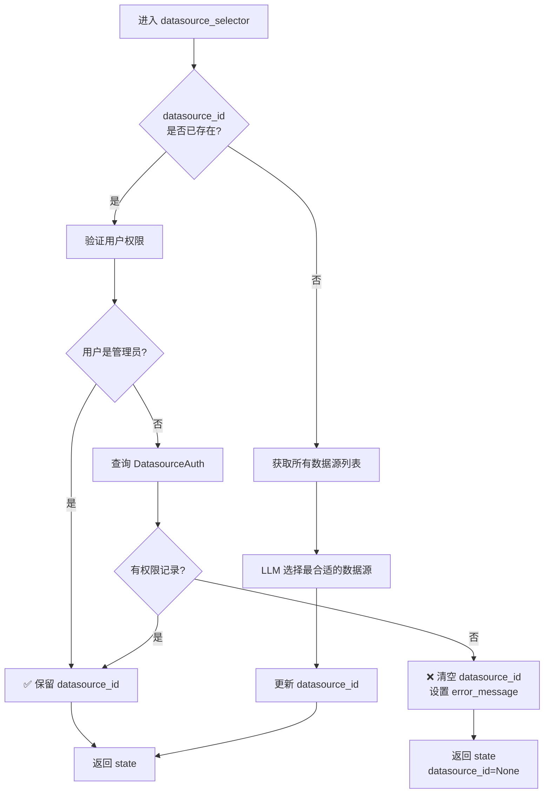

**条件路由：** `should_continue_after_datasource_selector()`
- `datasource_id` 为空 → 路由到 `error_handler` → END
- `datasource_id` 有效 → 路由到 `schema_inspector`

### 4.2 schema_inspector — 表结构检索

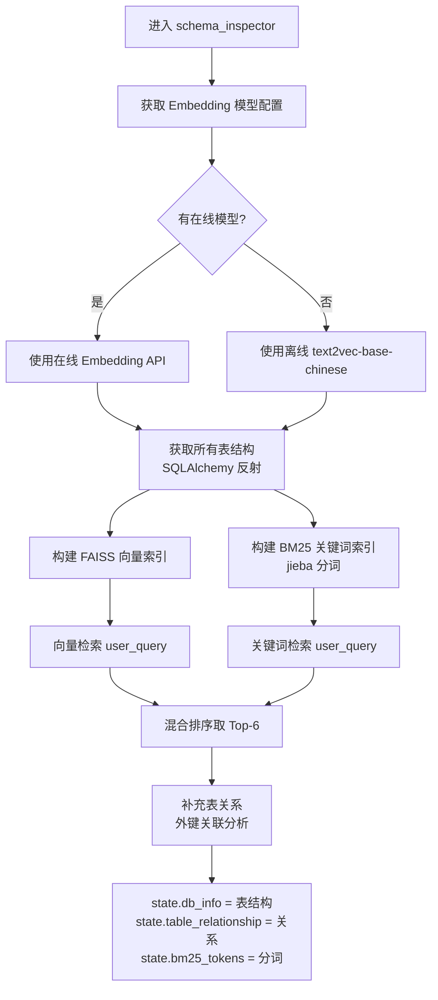

**核心实现：**
- 双重检索机制：FAISS 语义检索 + BM25 关键词匹配
- 缓存机制：`_table_info_cache` 缓存表结构，TTL 默认 300 秒
- 返回表数量可配置：`TABLE_RETURN_COUNT` 环境变量，默认 6

### 4.3 early_recommender — 早期推荐问题（后台异步）

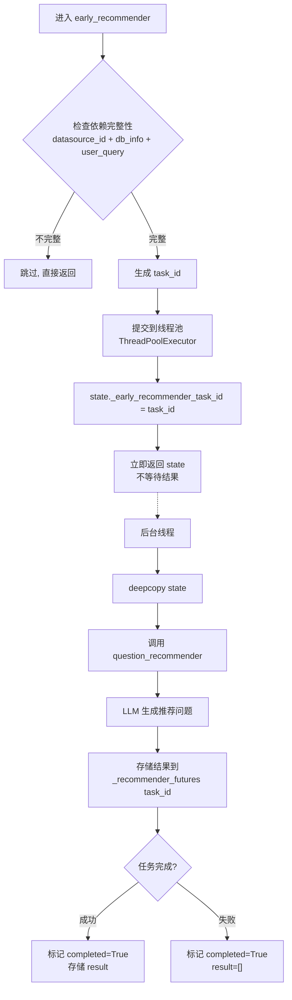

**关键特性：**
- **不阻塞主流程**：提交后台任务后立即返回
- **状态追踪**：通过 `task_id` 在全局字典 `_recommender_futures` 中追踪任务状态
- **超时回退**：后续 `unified_collector` 节点等待最多 5 秒，超时则直接重新生成

### 4.4 sql_generator — SQL 生成

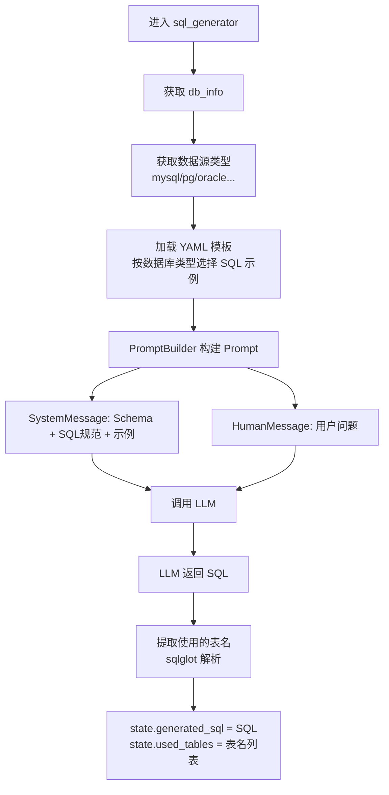

**Prompt 构建包含：**
- 数据库类型与引擎信息
- 表结构 Schema（M-Schema 格式）
- SQL 语法示例（YAML 模板，按数据库类型区分）
- 术语库（RAG 检索的相关术语）
- 训练数据（RAG 检索的 Q-SQL 对）

### 4.5 permission_filter — 权限过滤注入

```mermaid
flowchart TD
    A[进入 permission_filter] --> B[查询用户权限规则]
    B --> C[获取行级权限表达式树]
    B --> D[获取列级权限白名单]

    C --> E{有行级权限?}
    E -->|是| F[表达式树 → SQL WHERE 条件<br/>row_permission.py]
    F --> G["获取数据库引号配置<br/>mysql: &#96; / pg: &#34; / mssql: []"]
    G --> H[LLM 注入 WHERE 条件到 SQL]
    H --> I[filtered_sql = SQL + WHERE]
    E -->|否| J[filtered_sql = generated_sql]

    D --> K{有列级权限?}
    K -->|是| L[sqlglot 解析 AST]
    L --> M["SELECT * ?"]
    M -->|是| N[跳过列过滤<br/>warning]
    M -->|否| O[移除无权访问的列]
    O --> P[重写 SELECT 列表]
    K -->|否| Q[跳过列过滤]

    I --> R[state.filtered_sql = 最终SQL]
    J --> R
    P --> R
    N --> R
    Q --> R
```

**支持的权限操作符：** `eq`, `not_eq`, `lt`, `le`, `gt`, `ge`, `in`, `not_in`, `like`, `not_like`, `null`, `not_null`, `empty`, `not_empty`, `between`

### 4.6 sql_executor — SQL 执行

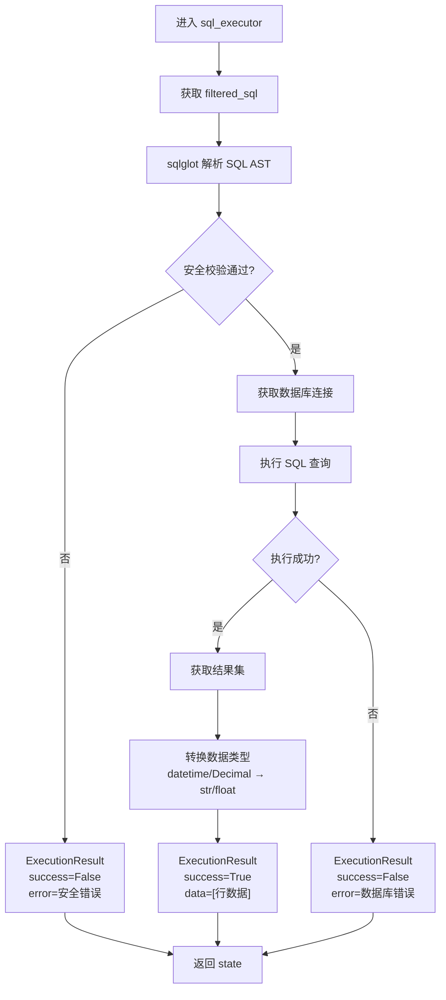

**安全校验：** 使用 `sqlglot` 解析 AST，禁止 INSERT、UPDATE、DELETE、DROP、ALTER、TRUNCATE、CREATE、GRANT、REVOKE、MERGE 等操作。

### 4.7 parallel_collector — 并行收集器

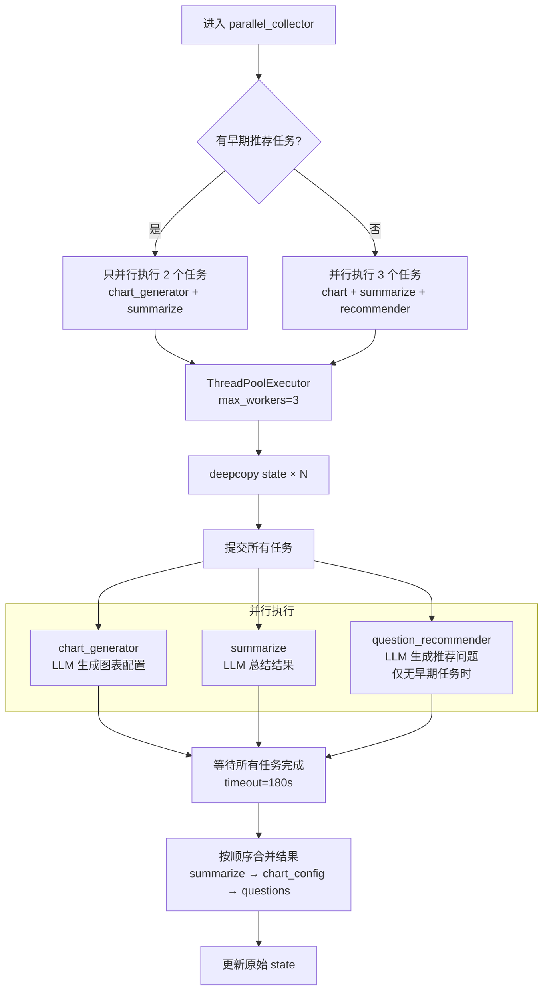

**并行策略：**
- 使用 `ThreadPoolExecutor`（全局线程池，3 个 worker）
- 每个任务使用 `deepcopy(state)` 避免并发修改
- 合并顺序：`summarize` → `chart_generator` → `question_recommender`
- 单任务超时 180 秒

### 4.8 unified_collector — 统一收集器

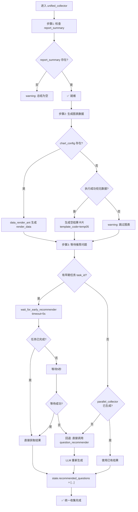

---

## 5. SSE 数据类型与前端交互

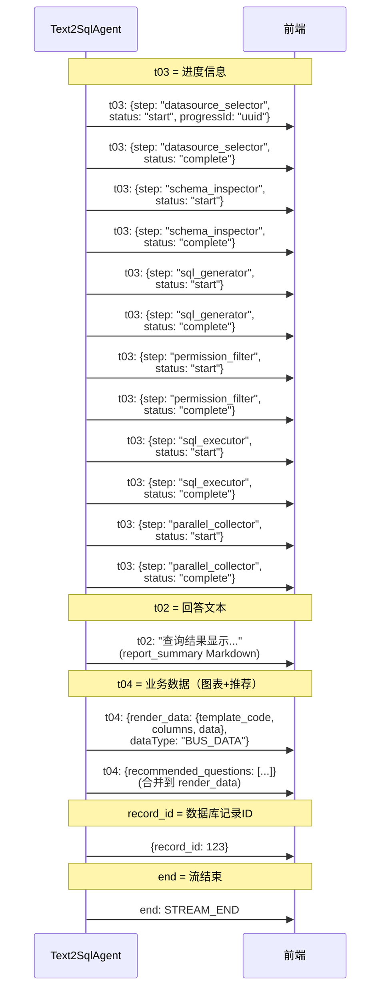

**SSE 数据类型映射：**

| data_type | 含义 | 内容 |
|-----------|------|------|
| `t02` | 回答文本 | `report_summary`（Markdown 格式的结果总结） |
| `t03` | 进度信息 | `{step, status: start/complete, progressId}` |
| `t04` | 业务数据 | `{render_data, recommended_questions, dataType}` |
| `record_id` | 记录ID | 数据库保存的问答记录 ID |
| `error` | 错误信息 | 异常时的错误文本 |
| `end` | 流结束 | `STREAM_END` 标记 |

---

## 6. 异常处理时序

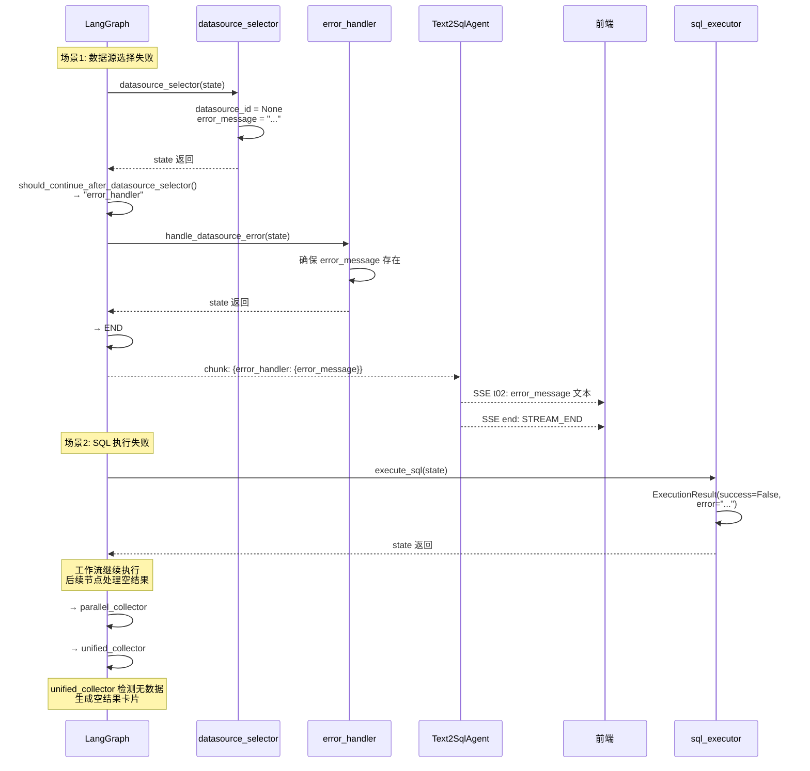

---

## 7. 并行执行与异步优化汇总

```mermaid
graph LR
    subgraph 主流程（顺序执行）
        A[datasource_selector] --> B[schema_inspector]
        B --> C[early_recommender]
        C --> D[sql_generator]
        D --> E[permission_filter]
        E --> F[sql_executor]
        F --> G[parallel_collector]
        G --> H[unified_collector]
    end

    subgraph 后台异步
        C -.->|提交后台任务| I[question_recommender<br/>线程池异步执行]
    end

    subgraph 并行执行 ThreadPoolExecutor
        G --> J[chart_generator]
        G --> K[summarize]
        G -.->|仅无早期任务时| L[question_recommender]
    end

    subgraph unified_collector 合并
        H --> M[1. 检查 summarize]
        H --> N[2. 生成 render_data]
        H --> O[3. 等待推荐问题<br/>timeout=5s]
    end

    I -.->|结果存储| O
    J --> M
    K --> M

    style I fill:#fff3e0,stroke:#f57c00,stroke-dasharray: 5 5
    style J fill:#f3e5f5,stroke:#7b1fa2
    style K fill:#f3e5f5,stroke:#7b1fa2
    style L fill:#f3e5f5,stroke:#7b1fa2,stroke-dasharray: 5 5
```

**优化策略总结：**

| 优化点 | 实现方式 | 效果 |
|--------|---------|------|
| 早期推荐问题 | `early_recommender` 节点提交后台线程池 | 与 SQL 生成/执行并行，节省 ~2-3 秒 |
| 并行图表+总结 | `parallel_collector` 使用 `ThreadPoolExecutor` | 图表和总结同时执行，节省 ~3-5 秒 |
| 超时回退 | `wait_for_early_recommender(timeout=5)` | 5 秒内未完成则直接重新生成，避免无限等待 |
| 表结构缓存 | `_table_info_cache` + TTL 300s | 重复查询同一数据源时跳过反射，节省 ~1-2 秒 |
| 状态深拷贝 | `deepcopy(state)` 给并行任务 | 避免并发修改导致数据竞争 |

---

## 8. 关键代码索引

| 组件 | 文件路径 |
|------|---------|
| 工作流定义 | [agent/text2sql/analysis/graph.py](file:///root/Aix-db/agent/text2sql/analysis/graph.py) |
| Agent 主控 | [agent/text2sql/text2_sql_agent.py](file:///root/Aix-db/agent/text2sql/text2_sql_agent.py) |
| 状态定义 | [agent/text2sql/state/agent_state.py](file:///root/Aix-db/agent/text2sql/state/agent_state.py) |
| 数据源选择 | [agent/text2sql/datasource/selector.py](file:///root/Aix-db/agent/text2sql/datasource/selector.py) |
| 表结构检索 | [agent/text2sql/database/db_service.py](file:///root/Aix-db/agent/text2sql/database/db_service.py) |
| 早期推荐 | [agent/text2sql/analysis/early_recommender_helper.py](file:///root/Aix-db/agent/text2sql/analysis/early_recommender_helper.py) |
| SQL 生成 | [agent/text2sql/sql/generator.py](file:///root/Aix-db/agent/text2sql/sql/generator.py) |
| 权限过滤 | [agent/text2sql/permission/filter_injector.py](file:///root/Aix-db/agent/text2sql/permission/filter_injector.py) |
| 行权限转换 | [agent/text2sql/permission/row_permission.py](file:///root/Aix-db/agent/text2sql/permission/row_permission.py) |
| SQL 安全校验 | [common/sql_security.py](file:///root/Aix-db/common/sql_security.py) |
| 并行收集器 | [agent/text2sql/analysis/parallel_collector.py](file:///root/Aix-db/agent/text2sql/analysis/parallel_collector.py) |
| 统一收集器 | [agent/text2sql/analysis/unified_collector.py](file:///root/Aix-db/agent/text2sql/analysis/unified_collector.py) |
| 图表生成 | [agent/text2sql/chart/generator.py](file:///root/Aix-db/agent/text2sql/chart/generator.py) |
| LLM 总结 | [agent/text2sql/analysis/llm_summarizer.py](file:///root/Aix-db/agent/text2sql/analysis/llm_summarizer.py) |
| 数据渲染 | [agent/text2sql/analysis/data_render_antv.py](file:///root/Aix-db/agent/text2sql/analysis/data_render_antv.py) |
| 推荐问题 | [agent/text2sql/question/recommender.py](file:///root/Aix-db/agent/text2sql/question/recommender.py) |

---

> 文档版本: 1.0 | 生成日期: 2026-06-30